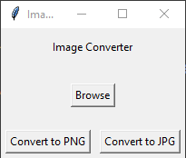

# Image Converter

  Simple image converter to learn some Python libraries.

## Table of Contents

* [General Info](#general-information)
* [Technologies Used](#technologies-used)
* [Features](#features)
* [Screenshots](#screenshots)
* [Usage](#usage)
* [Project Status](#project-status)
* [Acknowledgements](#acknowledgements)
* [Contact](#contact)

## General Information

  Converts PNG to JPG, and JPG to PNG

## Technologies Used

* Python 3.10.0
  * Pillow
  * Tkinter

## Features

* Convert PNG to JPG
* Convert JPG to PNG

## Screenshots

## Usage

Press Browse, navigate to image location, and press convert to whichever format you need.

## Project Status

Project is: _completed_

## Acknowledgements

* This project was based on [this tutorial](https://thecleverprogrammer.com/2020/12/02/image-converter-gui-with-python/).

## Contact

* [GitHub](https://github.com/ethan-pt)
* [Email](mailto:tubbeethan@gmail.com)
